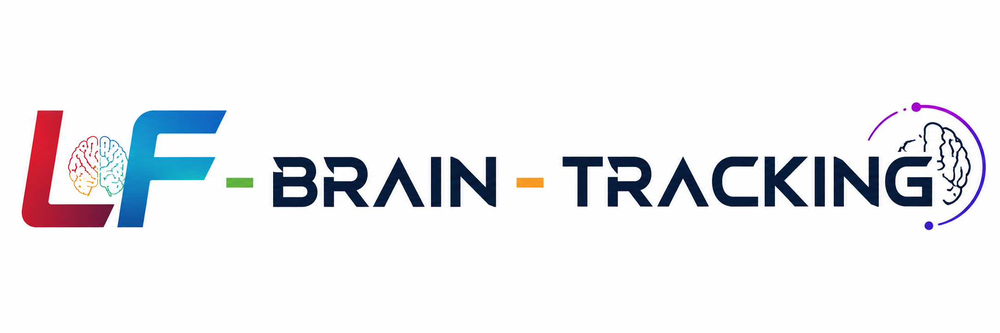

📌 Overview

LF-Brain-Tracking is a research framework for longitudinal brain analysis in low-field MRI (LF-MRI) environments.
It integrates motion correction, registration, super-resolution reconstruction, and deep learning-based segmentation to enable robust brain tracking under low-SNR and low-resolution conditions.

The framework is designed for:

    Low-field MRI systems (≤0.064T and portable scanners)
    Longitudinal brain studies
    Biomedical AI research (segmentation + tracking)
    Super-resolution MRI reconstruction pipelines
    Resource-constrained imaging environments

### Aim 1: Dense temporal sampling and super-resolution reconstruction

### Aim 2: Autonomous 0.05T MRI development

