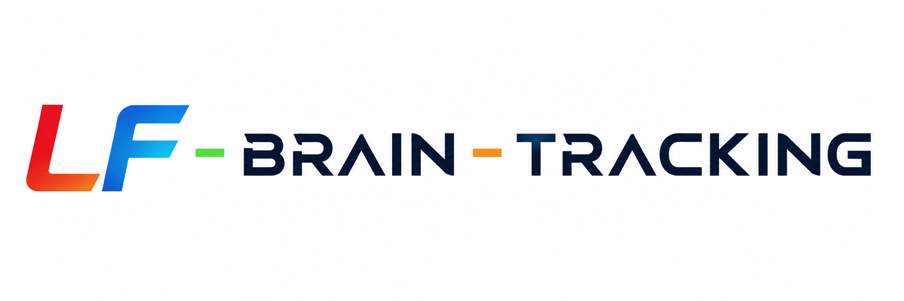
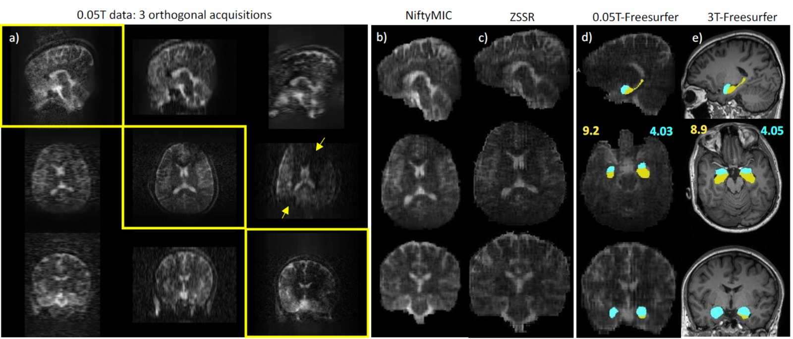

# Need for accessible imaging

Changes in brain morphology provide critical insights into a wide range of neuropsychiatric disorders. Magnetic Resonance Imaging (MRI) has been the primary tool to investigate these disorders, highlighting structural, functional, and metabolic changes. For example, 3T structural MRI data have significantly improved our understanding of the youths’ developing brain in health and disease. Recent studies have highlighted the need for densely sampled temporal neuroimaging data to maximize clinical insight in patients with mental health challenges. However, according to the World Health Organization, two-thirds of the global population does not have access to MRI. The cost, power, local expertise, and siting requirements of high-field MR systems (1.5T) impede longitudinal imaging in large populations, especially those in low-resource settings. The recent resurgence of portable, very low-field MRI (<0.1T) has provided an alternative to obtaining imaging data in an accessible and scalable manner. Currently, the major obstacle is that these portable scanners suffer from lower signal-to-noise ratio (SNR), impacting the volumetric accuracy required to monitor brain changes using structural imaging. These limitations render these scanners supplementary devices to high-field systems. For meaningful use, there is a critical need to develop novel methods to produce very low-field, structural MRI data statistically equivalent to or better than 3T data.

 
<h1 align="center">Low-field brain tracking using 0.05T MRI</h3>
 
Our image currently looks like ....

# Development of lf-brain-tracking tools.
 

This repository is currently under active development. Some modules are subject to frequent updates.

## 🚧 Description
This is the development branch for the low-field-brain tracking project. It integrates development or investigation of advanced lf-mri tools for motion correction, lf-simulations, zero-shot denoising, super-resolution reconstruction, and brain segmentation to enable robust brain tracking under low-SNR and low-resolution conditions.

# Registration and Orthogonal Acquisition Combination

NiftyMIC is a research-focused toolkit for motion correction and volumetric image reconstruction. In **lf-brain-tracking**, NiftyMIC is used for motion correction and the combination of three orthogonal MRI acquisitions into a single high-quality reconstructed volume.

# Brain Parcellation

Brain parcellation tools such as **SynthSeg** and **SuperSynth** are integrated to enable automated segmentation and anatomical parcellation of low-field MRI scans.

# Publications

## Aim1: Track youth brain changes at 0.05T using densely sampled neuroimaging data and DL-SRR

#### Conference proceddings
 

1. Girish, N., Sharma, A., and Geethanath, S., "Zero-shot self-supervised super-resolution reconstruction of MRI to track brain changes using volumetry: application to high and low-field data," SPIE Medical Imaging, 2026.
2. Sharma, A., & Geethanath, S. (2026). Learning beyond interpolation: Zero-shot resolution enhancement for low-field MRI. International Society for Magnetic Resonance in Medicine (ISMRM 2026) Annual Meeting.
3. Sharma, A., Oiye, I. E., Byrum, R., Holbrook, M., Cong, Y., Calcagno, C., Mani, V., & Geethanath, S. (2026). Enhancing low-field MRI image quality for Nipah virus infection imaging using deep learning. International Society for Magnetic Resonance in Medicine (ISMRM) Annual Meeting. 
4. Sharma, A., Oiye, I. E., Byrum, R., Holbrook, M., Cong, Y., Calcagno, C., Mani, V., & Geethanath, S. (2025). Physics-informed low-field Nipah virus MRI image reconstruction of non-human primates in a BSL-4 facility. International Society for Magnetic Resonance in Medicine (ISMRM) Annual Meeting.

#### Preprints
 

1. Oiye, I. E., Sharma, A., Mohanta, Z., Sankaralayam, D. S., Uchida, Y., Akinwale, T., ... & Geethanath, S. (2025). A Hands-On Workshop for Constructing a Low-Field MRI System in Three Days. arXiv preprint arXiv:2511.20979.

#### Revised submission
 

1. Sharma, A., Lu, H., Greenspan, H., Lin, D. D., & Geethanath, S. (2025). Enhancing low-field magnetic resonance image quality using deep learning: Challenges, opportunities, and resources. Manuscript under revision in NMR in Biomedicine.

#### Ongoing work

1.	Ajay Sharma, Ivan Etoku Oiye, Kunal Aggarwal, Venkatesh Mani, Claudia Calcagno, Joseph Laux, Yu Cong, Michael R. Holbrook, and Sairam Geethanath, “Feasibility of very-low-field MRI for imaging Nipah-virus infected non-human primates in a bio-safety level four facility”.

## Aim 2: Automate 0.05T MRI (auto-MRI) to deliver consistent scanner operation and image quality for robust deployment

Open-source repository for digital twin publicly available [Auto-MRI](https://github.com/imr-framework/virtual-scanner-adt)

#### Conference proceddings
 

1. Kinyera.L, Oiye, I. E., Geethanath.A, Obungoloch. J, & Geethanath, S. (2026).  An Autonomous Digital Twin Agent for the Parametric Design and Validation of Halbach Array Magnets for Low-Field MRI. International Society for Magnetic Resonance in Medicine (ISMRM) Annual Meeting.

# Readings

Shocher, A., Cohen, N., & Irani, M. (2018). “zero-shot” super-resolution using deep internal learning. In Proceedings of the IEEE conference on computer vision and pattern recognition (pp. 3118-3126).

Billot, B., Greve, D. N., Puonti, O., Thielscher, A., Van Leemput, K., Fischl, B., ... & Iglesias, J. E. (2023). SynthSeg: Segmentation of brain MRI scans of any contrast and resolution without retraining. Medical image analysis, 86, 102789.

Aggarwal, K., Cong, Y., Lee, J. H., Mani, V., Calcagno, C., Holbrook, M. R., & Geethanath, S. (2023). Feasibility of textural analysis and very-low-field magnetic resonance for imaging Nipah virus infection. In ISMRM Conference Proceeding.

Ssentamu, T., Kimbowa, A., Omoding, R., Atamba, E., Mukwaya, P. K., Jjuuko, G. W., & Geethanath, S. (2025). Denoising very low-field magnetic resonance images using native noise modeling. Frontiers in Neuroimaging, 4, 1501801.

# Other open-source tools for MRI education.

### DELTA DIY MRI

Learning through building and playing [DELTA DIY project](https://github.com/delta-diy-mri/delta-diy-mri.github.io).

### Virtual Scanner

Virtual Scanner Tabletop Games [Virtual Scanner](https://github.com/imr-framework/virtual-scanner/).

